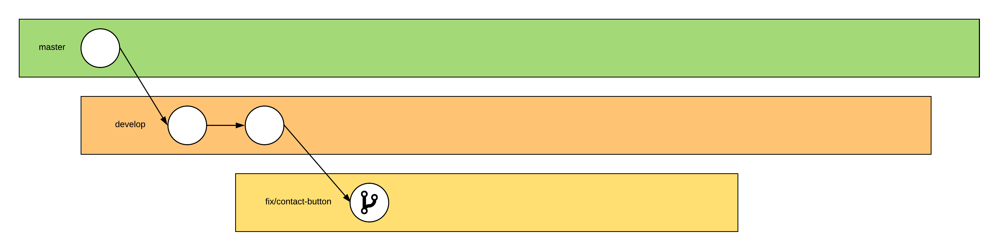
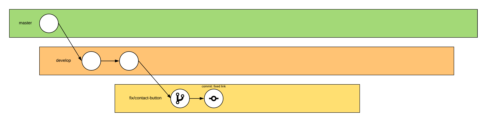
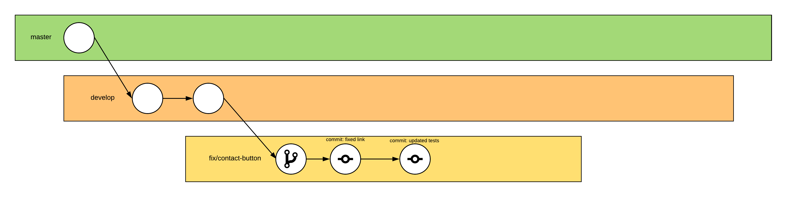
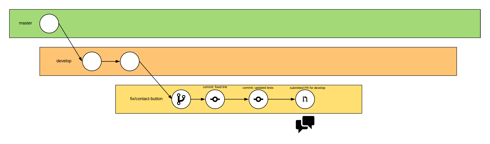
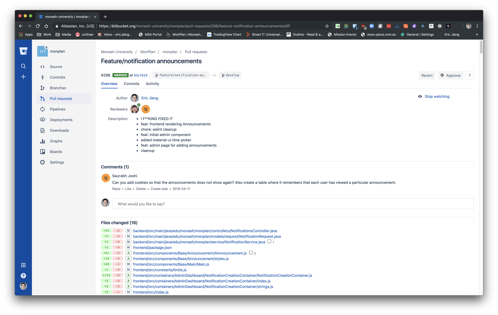
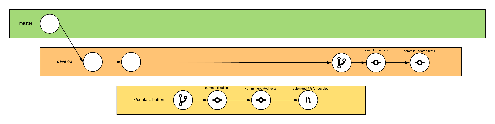
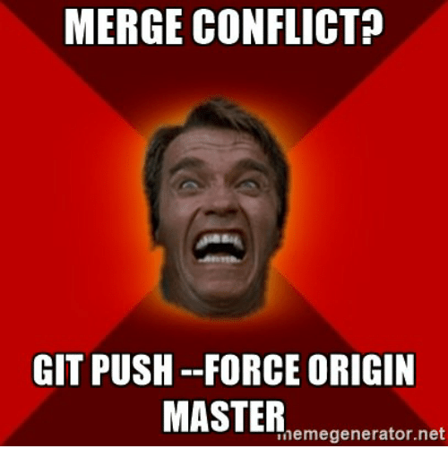

Theme: Business Class
autoscale: true
text: Google Sans, #006cab
text-strong: Google Sans Bold, #006dae
text-emphasis: Google Sans Italic
header: Google Sans, #006CAB
header-strong: Roboto Strong,#005DAE
header-emphasis: Reklame Script, #53585F  
code: Fira Code Medium, #EE783F, #8B3D90, #2E59A2, #DF393F, #1EA8D9
background-color: #FFFFFF  
footer: August 2018 | Copyright Ⓒ Eric Jiang/Monash University 2018 | Adapated from "Gitting Started at Hackathons" tech talk
slidenumbers: false
## Introduction to Git and the MonPlan Development Workflow

### Eric Jiang (@lorderikir)


---

So, I love coding 👨‍💻 and I love working in teams 👪

_But what if there was a way that I good remember how the code look liked throughout its stage, for example if something went wrong and I want to go back to a previous version?_


---

# First of all, what is Git?


---

# Git

> Git is a version control system for tracking changes in computer files and coordinating work on those files among multiple people
> -- [Git-SCM Website](https://git-scm.com/)


---

# How Git Works


---

# Some Terminology

## **Repository** 
> The Git repository is stored in the same directory as the project itself, in a subdirectory called .git. Note differences from central-repository systems like CVS or Subversion:

* There is only one .git directory, in the root directory of the project.
* The repository is stored in files alongside the project. There is no central server repository.


---
# Some Terminology

## **Branches** 
> A branch in Git is simply a lightweight movable pointer to one of these commits. The default branch name in Git is master


---

# Git File Lifecycle


---
# Some Basic Commands

| Command      | Description                            |
| ------------ | -------------------------------------- |
| `git clone`  | Clones a repository locally            |
| `git add`    | Stages changes to file(s) for a commit |
| `git commit` | Creates a commit (set of changes)      |
| `git push`   | Push changes to the hosted repo        |


---

# Using Git within teams

Well, working with teams 👪 may be hard. There are generally two ways you can work off a repository.

* Using Branches
* Using Forks

We use branches at MonPlan!


---

# Use Branches 🌳 for Versioning Control

1.  Make a branch with the feature name or your own username
2.  Every time you commit and push up
3.  Make a Pull Request
4.  Merge the pull request

One of the best workflows is known as _GitFlow_


---

# GitFlow - Used with monPlan Git Workflow


* **master**: branch is the key branch, everytime for release
* **develop**: _unstable_, most of the PRs should go here
* **'feature/\*'**, **'fix/\***, etc.: are 'for purpose' branches, these branches are for development

_This slide has been adapted from my [CI-CD talk](https://github.com/lorderikir/cicd-techtalk)_


---

# So we know that development is done incrementally


---

# Imagine we using Git within our practices

And one of my team mates, Nicholas has found a bug within one of our buttons.


---

# So, he creates a new branch to fix the bug



```shell
# update our develop branch
git checkout develop
git pull
# we create a new branch
git branch fix/contact-button
# we make the new branch the new working branch
git checkout fix/contact-button
```


---

# The branches we use:
- `fix`
- `refactor`
- `feature`


---
# He fixes the code and stages the change in commits



```
git add .
git commit -m "new commit"
git push
```


---

# He fixes the code and stages the change in commits



```
git add .
git commit -m "new commit"
git push
```


---

# He then makes a PR into my develop or master branch



## Where we discuss his proposed changes


---




---

# We then merge the Changes




---

# This would also work for...

* Upgrades to the codebase
* Refactoring our legacy code
* Upgrading frameworks to newer versions

_Unfortunately we won't go into fixing merge conflicts in this talk_


---

# Why is using GitFlow important?

* We seperate production code and our 'work-in-progress' (WIP) code.
* We have a clearer understanding of what each developer is working on
* We can branch off WIP branches and merge changes in
* Relatively easier (not always) to fix merge conflicts
* Some CI/CD tools only run off branches (not PRs)
* We can set our CI/CD to deployment so that it can deploy off branches (i.e. `develop` to _dev_, `master` to _staging_ or _qat_ and `deploy` to _prod_)


---

# Key notes 🗒️

* Version Control over Development is really important as it helps keep 'backups' and you can see the changes
  * You can always see who pushed out the broken code with `git blame` 😈
* Git is always useful as you can always revert broken code or changes
* Branching and forking is basically the same,
  * when working we typically use branches over forks as we can solve merge conflicts more easily (and locally)


---

# Please DO NOT ever `git push --force`




---

# Key things to look 🔭 out for.

* Merge conflicts are always the hardest part
* Be careful of `git merge` and `git rebase` commands. Always `merge` don't `rebase`
  * This is because rebase always applies your changes last (assumes you are always correct)
  * When merging between branches and fixing conflicts always work with a team-mate


---


---
# Here's one of the best and easiest ways to resolve a conflict

1. We go to the target branch and pull down the latest changes
2. We then 'checkout' our current working branch and create a new branch off the working branch 
3. We then attempt to merge our target branch into our new branch
4. Resolve Conflicts (by choosing the right pieces of code you want), VSCode makes this really easier
5. Merge the new branch into our current branch
6. Merge the current branch into the target branch


---

## Got it? 🤷‍♂️

### It's probably easier if I show you commands

### Let's Imagine we are merging a feature from `feature/awesome-feature` branch into `develop`


---

# This is the current state of the branches


---
We go to the target branch and pull down the latest changes

[.code-highlight: 1,2]
```
git checkout develop
git pull
git checkout feature/awesome-feature
git checkout mergconf/feat-develop
# ...
```


---
We then 'checkout' our current working branch and create a new branch off the working branch 

[.code-highlight: 3]
```
git pull
git checkout feature/awesome-feature
git checkout mergconf/feat-develop
git merge develop
# ...
```


---

We then attempt to merge our target branch into our new branch

[.code-highlight: 3]
```
git pull
git checkout feature/awesome-feature
git checkout mergconf/feat-develop
git merge develop
# ...
```


---

Resolve Conflicts (by choosing the right pieces of code you want), VSCode makes this really easier


Stage and commit changes 
```
git add .
git commit -m "resolved merge issues"
```


---

Here's how the state of the branches are:


---

Merge the new branch into our current branch


[.code-highlight: 1,2]
```
git checkout feature/awesome-feature #get to current working branch
git merge mergconf/feat-develop
git push # push to repo
```


---

Push changes to repository

[.code-highlight: 3]
```
git checkout feature/awesome-feature #get to current working branch
git merge mergconf/feat-develop
git push # push to repo
```


---

# Our Conflicts would have been solved now! 🎆


---
# Questions? <br/><br/> 🤔 🎤 📣


